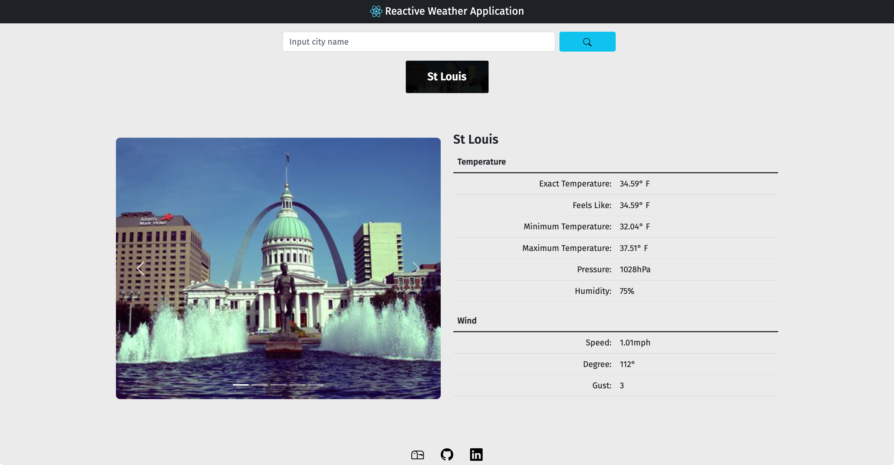

**Reactive Weather Web Application**

**Created by: [Stephan Randle](https://github.com/stephansama)**

[Click Here]() to see the deployed application

**Program Description**

Load weather information from openweather api
and uses bing image search to find pictures of weather locations

**APIs**

-   [Open Weather Map API](https://openweathermap.org/current)
-   [Bing Image Search API](https://www.microsoft.com/en-us/bing/apis/bing-image-search-api)

**NPM Packages**

-   [bootstrap](https://www.npmjs.com/package/bootstrap)
-   [react](https://www.npmjs.com/package/react)
-   [react-bootstrap](https://www.npmjs.com/package/react-bootstrap)
-   [react-dom](https://www.npmjs.com/package/react-dom)
-   [react-dotenv](https://www.npmjs.com/package/react-dotenv)
-   [react-scripts](https://www.npmjs.com/package/react-scripts)
